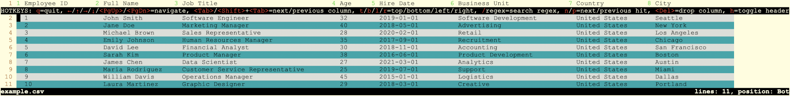

Description
-----------

`tabv` is an interactive pager for the command-line based on bash, awk, and vim, which visualizes tabular text files (TSV, CSV, and the like) in a column-aligned format. I developed this script predominantly for myself, because I was not satisfied with how alternative tools (most notably [visidata](https://www.visidata.org/)) handle [VCF files](https://en.wikipedia.org/wiki/Variant_Call_Format), which I work with on a daily basis. The script is small, simple and gets the job done, but for most use cases visidata is a more powerful tool.

Features
--------

- fixed header line at top of screen
- automatically find header line (i.e., skip comment lines at the beginning of file)
- row & column numbering
- alternating row colors
- hide (drop) column under cursor
- regular expression search
- interrupt loading of huge files (to speed up formatting and reduce memory consumption)
- detect double-quoted columns
- read from `stdin`

Screenshots
-----------

Example without `tabv`:


Example with `tabv`:


Usage
-----

Command-line options:

```
tabv [-d DELIMITER] [-t TRUNCATE_COLUMN] [-q] [FILE]

    -d field delimiter [detect from file extension]
    -t truncate columns longer than this many characters [unlimited]
    -q disable auto-detection of double-quoted columns
```

Installation
------------

Download the script `tabv` and place it in a directory in your `$PATH` environment variable, for example in `/usr/local/bin`. Make sure the script is executable.

```
sudo -s
cd /usr/local/bin
curl -L -o tabv https://raw.githubusercontent.com/suhrig/tabv/main/tabv
chmod a+x tabv
```

Known Issues
------------

- slow with big files
- high memory consumption with big files, since the entire content is held in memory
- non-ASCII characters can break the alignment
- auto-detection of double-quoted columns only works if all columns are wrapped in quotes
